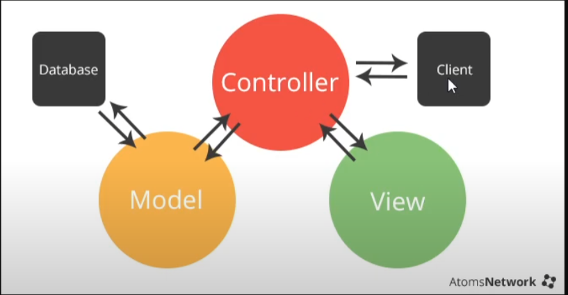
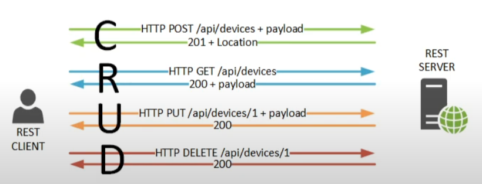
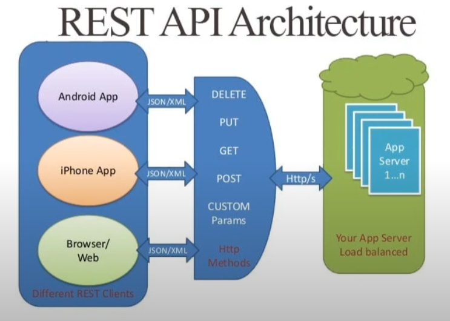

# API REST
API REST o Application programming interface Representational state transfer

Las API son conjuntos de definiciones y protocolos que se utilizan para diseñar e integrar el software de las aplicaciones. Suele considerarse como el contrato entre el proveedor de información y el usuario, donde se establece el contenido que se necesita por parte del consumidor (la llamada) y el que requiere el productor (la respuesta).Por ejemplo, el diseño de una API de servicio meteorológico podría requerir que el usuario escribiera un código postal y que el productor diera una respuesta en dos partes: la primera sería la temperatura máxima y la segunda, la mínima.

REST no es un protocolo ni un estándar, sino más bien un conjunto de límites de arquitectura.

| Operaciones CRUD | Peticiones REST |
| ---------------- | --------------- |
| INSERT           | POST            |
| SELECT           | GET             |
| UPDATE           | PUT             |
| DELETE           | DELETE          |

## Modelo vista controlador

## Modelo HTTP

## REST API Architecture
Está desarrollado con principios SOLID

## Herramientas que usaremos
* POSTMAN
* JSONPlaceholder
* Insomnia.rest (Core)
* NodeJS